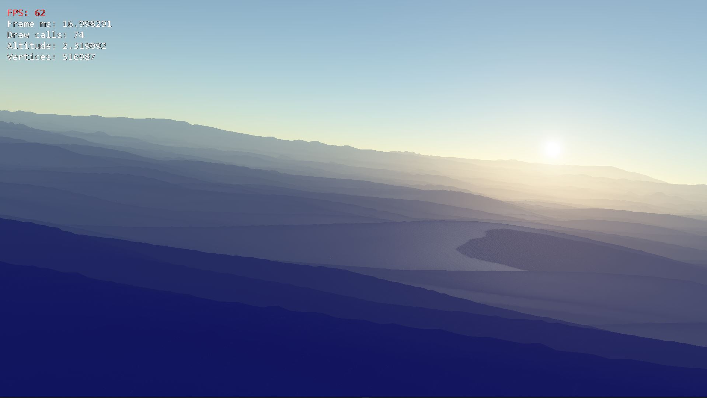
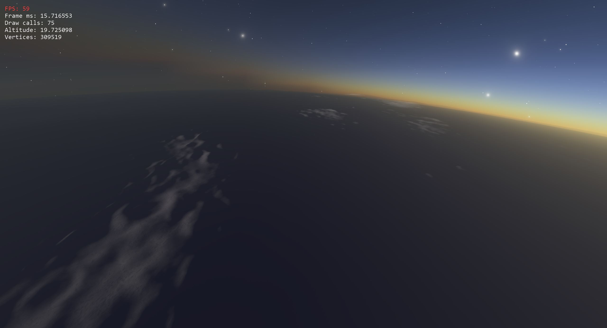
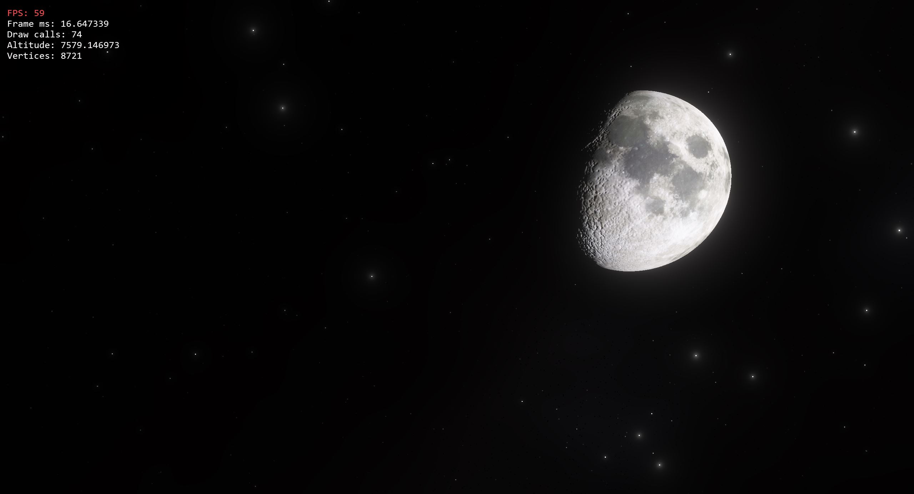
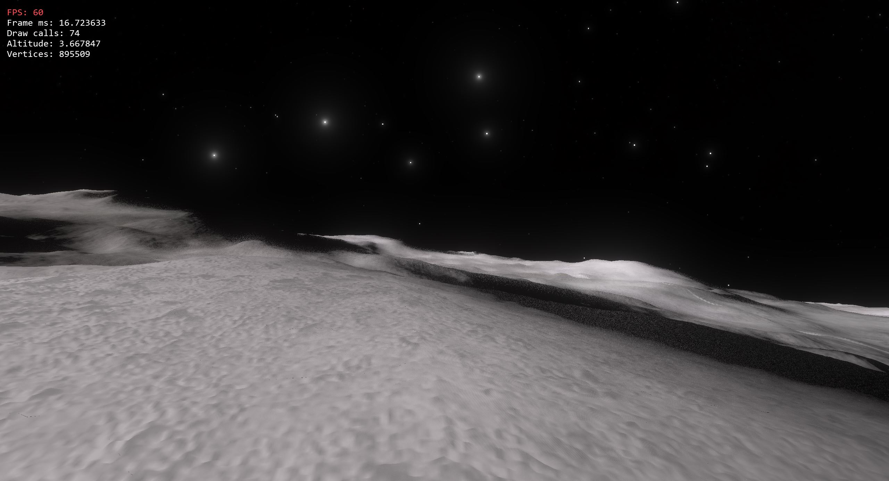
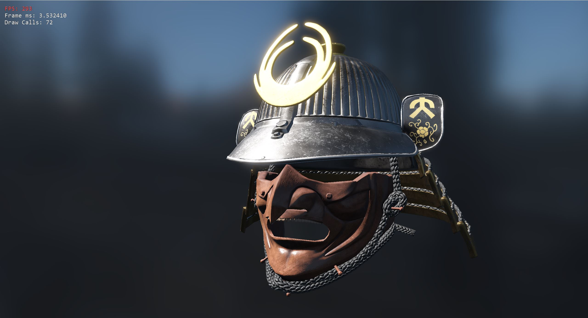
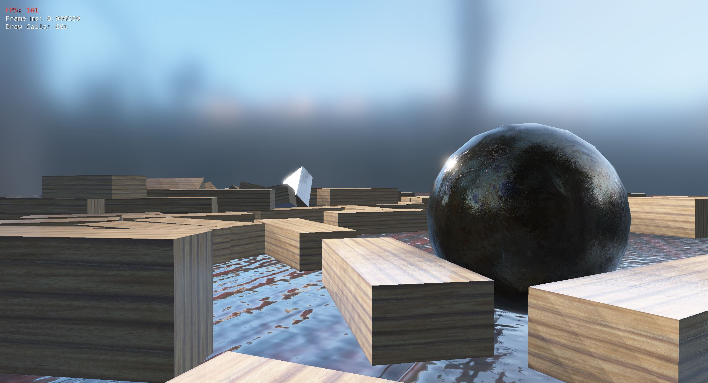
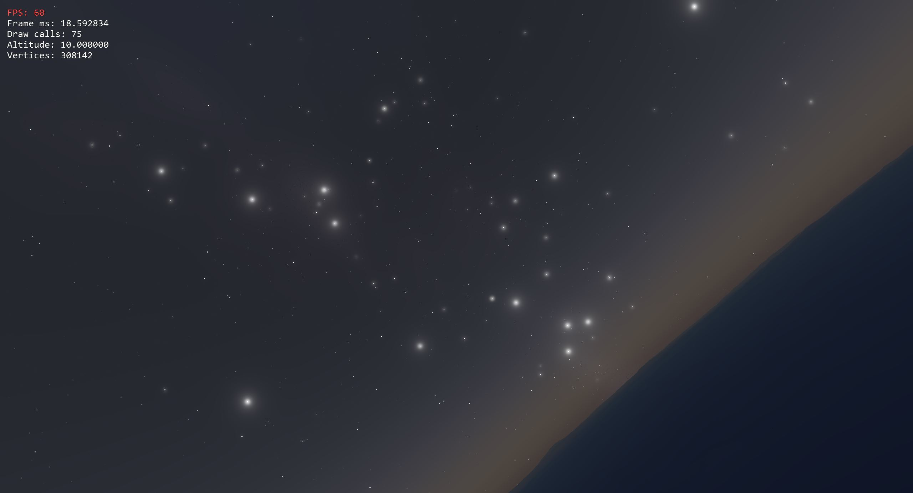
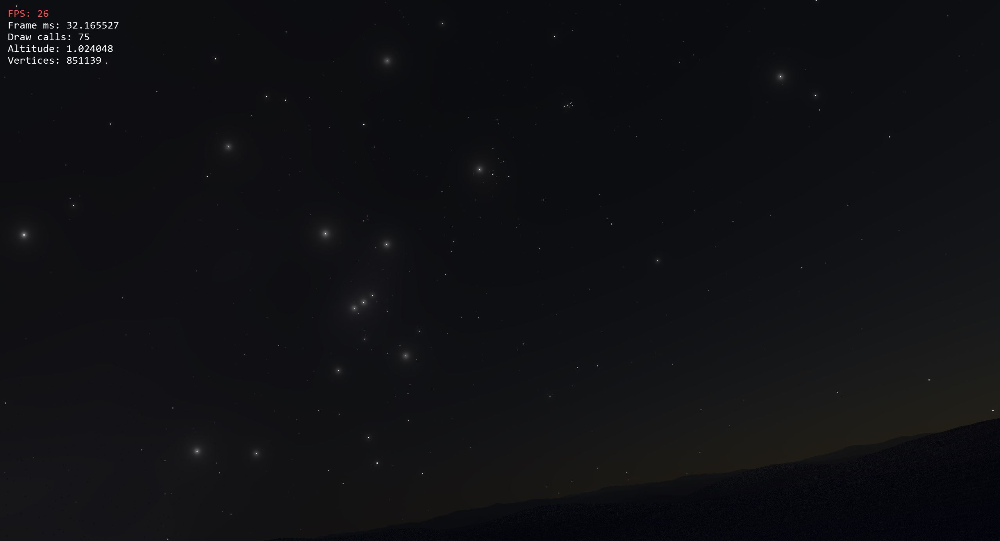
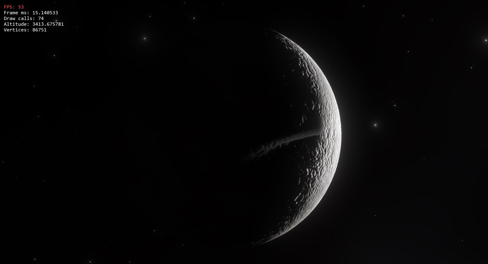
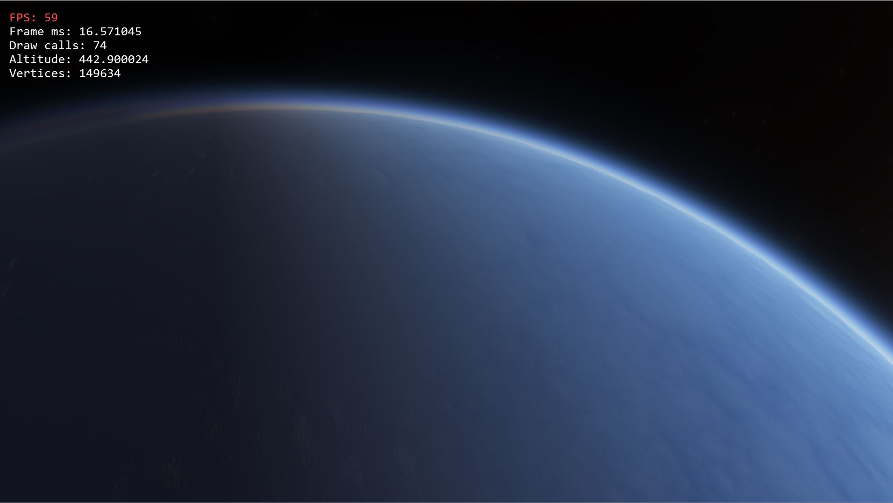

# Extra Terrestial Engine

Space sim focused engine created from a merge of:
 * my [OpenGL Framework](https://github.com/Illation/GLFramework)
 * my [Planet Renderer](https://github.com/Illation/PlanetRenderer)
 
__Full feature list and backlog here: [LINK](features.md)__

## Build Status

| Service | System | Compiler | Branch | Status |
| ------- | ------ | -------- | ------ | ------ |
| [AppVeyor](https://ci.appveyor.com/project/Illation/etengine)| Windows 32 | Visual Studio 2015 | master | 

## How to build

#### Building Bullet Physics
The Engine uses Bullet Physics and has prebuilt libfiles for Visual Studio 2015. If you want to use a different compiler, you need to build bullet for it, otherwise you can skip this section.

Clone bullet from https://github.com/bulletphysics/bullet3/ and download [CMake](https://cmake.org/).
You will need .lib files for Debug_x32, Release_x32, Debug_x64 and Release_x64, and they need to go in the respective folders in dependancies.

When you generate the project files with cmake, make sure to check the option "USE_MSVC_RUNTIME_LIBRARY_DLL".
Build ALL_BUILD and check the /lib/ directory where you cloned bullet. The files you should copy are:
 * BulletCollsion.lib
 * BulletDynamics.lib
 * LinearMath.lib

Make sure to remove any "_Debug" suffixes from the filenames.

#### Building the Engine
ETEngine uses a project generation tool called [GENie](https://github.com/bkaradzic/GENie) to generate project files. Currently only project generation for Visual Studio 2015 has been tested, but support for Linux makefiles should soon be added.

In order to build the project, first download the GENie executable. The easiest thing for later use would be installing it in your PATH, but you can also use the executable anywhere else.
Next, open a terminal and navigate to the repository root folder, and execute:

    genie --file=build/genie.lua vs2015

If you didn't install GENie in your path it would look more like

    .\relative\path\to\your\genie.exe --file=build/genie.lua [preferred visual studio version]

Next open the solution that was generated at **build/ETEngine.sln** in visual studio, select the desired configuration (_Development_ is good for most purposes), and build as usual.

The final executable will appear in **bin/[configuration]_[platform]/Demo/Demo.exe**

## Unit Tests

ETEngine uses [catch](https://github.com/catchorg/Catch2/tree/Catch1.x) (currently version 1) to perform unit tests.

To run unit tests, generate the project files as before, and set _Testing_ as your startup project, and compile it. 

For a brief test you can simply run it from Visual Studio and check that the exit code is **0x0**
If you want more details on tests that fail, run the generated executable from a terminal:

    .\bin\[configuaration]_[platform]\Testing\Testing.exe
 
## Acknowledgments

Currently used libraries: SDL2, catch, FreeImage, freetype, Bullet Physics, OpenAL-soft, stb_vorbis, RTTR, GLAD, MikkTSpace and Assimp.

Also a bunch of (modified) code from Eric Brunetons [atmospheric scattering implementation](https://github.com/ebruneton/precomputed_atmospheric_scattering).

for library licenses see Library Licenses.md

## Screenshots

#### Atmosphere
Atmospheric Perspective

Upper Atmosphere

#### Planets
From Space

Surface view

#### Render Pipeline
PBR and IBL

Experimental CSM and SSR

2500 Lights with deferred rendering and Bloom

#### Physics

#### Star fields

#### Moar Screenshots

