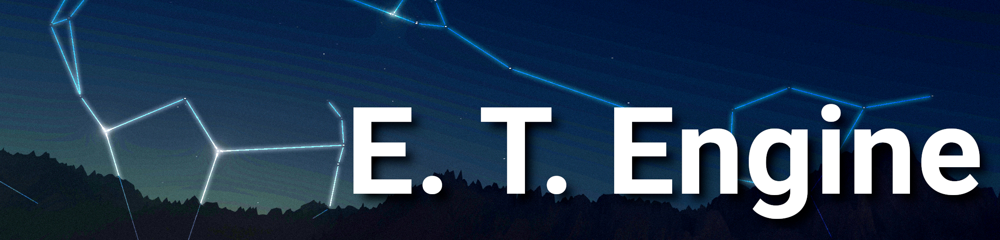
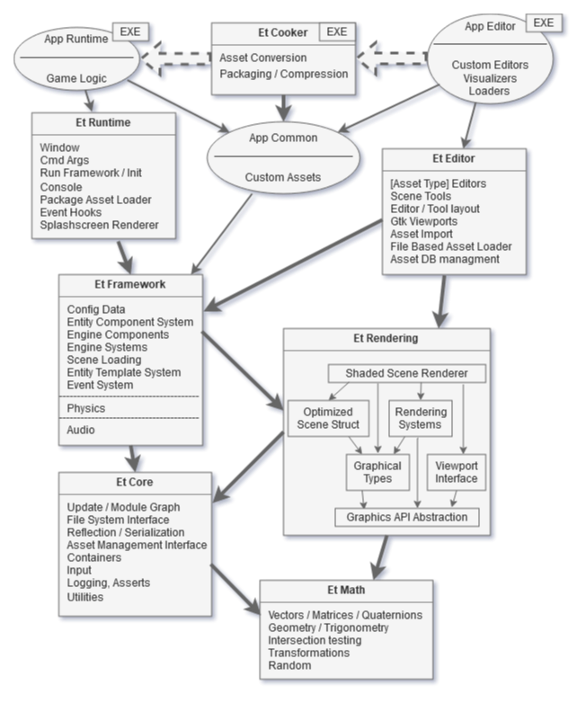
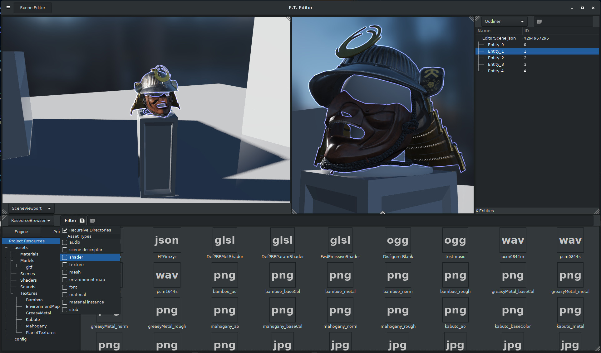

***********************************************************************************

#### Realtime 3D Graphics/Simulation/Game-Engine written in C++ 14.

***********************************************************************************

Focus is on ease of use, extensibility, performance and providing rendering features for planet scale environments, enabling space games and simulations.

__E.T.__ stands for "extra terrestial" due to the goal for this technology to go to space one day.

This project is under active development, and while a wide range of features are implemented and the overall architecture is approaching a cohesive state, many of the planned improvements are likely to touch a large crossection of the codebase.
Therefore, while breaking changes are usually implemented in separate branches, the interface on the master branch changes relatively frequently.

***********************************************************************************

 

#### Discuss it on [Discord](https://discord.gg/PZc37qPwVC)!

 

***********************************************************************************

## Features:

#### Rendering

Rendering is based on modern principals including Physically based Rendering.
The data driven material system allows for custom shaders and parameter inheritance through material instances (similar to UE4).
A variety of rendering features aimed at space simulation have been implemented, such as planet terrain generation, atmospheric scattering and Starfields based on real sky data.

#### Modular Architecture

The project is split into multiple libraries. Low level libraries such as core or rendering can be used independently from high level ones such as the framework.
Many features have interfaces and implementations, allowing overriding of functionality. If you want to implement your own renderer or support a different file system, you can do that.

#### Data oriented design
Many performance critical sections have been programmed with aspects such as cache locality in mind.
The renderer uses an optimized scene structure and can operate independently from the gameplay side scene.
Gameplay features are implemented using an Archetype based Entity Component System.

#### Data Driven
Anything that is not a behavior can be described with data. The Resource manager allows for custom asset types. 
Reflection of data structures allows for automated serialization and deserialization of content.
The work in progress editor will allow for easy editing, and control the workflow from Content creation tools to optimized engine formats.

 
 

## How to build

For visual studio 2017:

    git clone https://github.com/Illation/ETEngine
    cd ETEngine/Projects/Demo
    cmake -G "Visual Studio 15 2017 Win64" -S . -B build
    cmake --build build --target all --config Develop
    cmake --build build --target install
    cmake --build build --target cook-installed-resources-EtEngineDemo

For more information (including unit tests and content cooking) check [the build documentation](doc/building.md).

## Continuous Integration

Due to an [issue](https://github.com/Illation/ETEngine/issues/17) with library dependencies CI is currently not working. However the project has been built outside of automated build scripts and works just fine.

## Background

This project started off in 2016 as an [OpenGL graphics framework](https://github.com/Illation/GLFramework) based on the "Overlord Engine" (Dx11) from the Graphics Programming course at [Howest University](https://www.digitalartsandentertainment.be/)

In parallel I was writing my graduation work on [realtime planet rendering](https://github.com/Illation/PlanetRenderer), and in 2017 I merged the two projects into this engine. 

Since then I added a variety of graphics and gameplay features, however due to the design at the time this was getting increasingly difficult.

Therefore, starting in 2019, the main focus has been on improving the Architecture and focusing on useability and extensibility, and the codebase has been nearly completely rewritten since. 

#### Approximate Changelog

__0.0 :__ 
 * Initial OpenGL Graphics Framework implementation

__0.1 :__ 
 * Virtual File System
 * Deferred rendering
 * Physically based rendering
 * Post processing
 * Planet rendering 
 * atmospheric scattering

__0.2 :__ 
 * Custom math library
 * Physics and Audio integration
 * Unit testing
 * Continuous integration
 * Json parser, GLTF

__0.3 :__ 
 * CMake build
 * Separate core library - update  system
 * reflection; serialization / deserialization

__0.4 :__ 
 * Resource Manager, Asset Database
 * Package file format
 * Cooker
 * Asset Pointer

__0.5 :__ 
 * GTKmm based editor app
 * Abstract Graphics API
 * Cross context rendering viewport - support for multiple (3D) viewports
 * Flexible editor tool windowing system

__0.6 :__ 
 * Separated rendering / framework / runtime libraries
 * Optimized render scene with minimal graphics objects - scene renderer no longer traverses scene graph
 * Data driven material system

__0.7 :__ 
 * Archetype based Entity Component System
 * Removed previous scene graph structure, all game object behavior is expressed through components and systems
 * Scene Descriptor asset - scenes now described in files
 * Application Runtime and Editor can share custom data assets through common library
 
## Third Party

For a list of third party libraries and licenses check [HERE](Engine/third_party/README.md).

## Screenshots

#### Atmosphere and Planets

#### Render Pipeline; Physics

